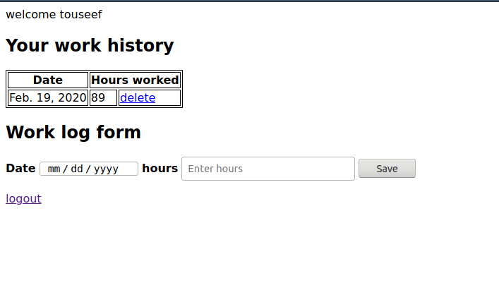

# Documentation written by Touseef Ahmad

## how to run
1) just type
```python 
python manage.py runserver
```
2) go to browser and type localhost:8000. you'll be redirected to login page
3) click on create account
4) fill the form and click signup
5) now you'll be redirect to home page where you can view add delete working hours. (initially you wont see anything under working history. makes sense?)
6) once you start adding working hours you'll see them in a table from where you can delete them
## sample image

## Apps
This project contains 2 apps **users** and **work_diary**

## Users
this app has three main objectives 1) signup 2) signin 3) logout

## work_diary
this app has two main objectives add and delete working hours

## Working urls
Following are the urls and their function.
1) / : the home url user is redirected to login page if not logged in. supports both post and get request. user can add and view their working hours only
2) /users/login : both get and post requests . user view login page and can login
3) /users/register : both get and post requests . user view signup page and can signup
4) /users/logout : supports get request logs the user out
5) /delete/work_id/ : deletes the work entry 
